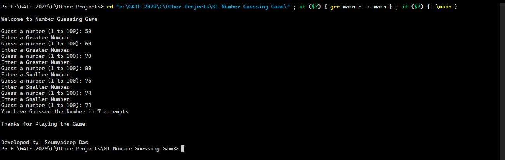

# 01 Number Guessing Game

A simple C program where the user guesses a randomly generated number. The aim is to guess the number in least turns.
The program guides the user whether to guess a greater number or guess a smaller number everytime the user enters a number.

## Output

