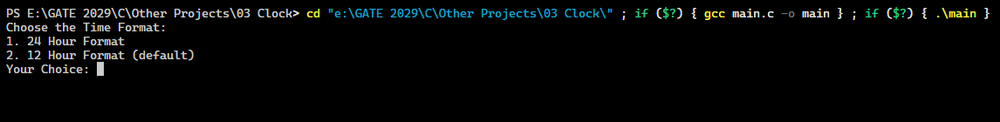

# 03 Clock

A C program that simulates a constantly updating digital clock in the terminal, featuring customizable time formats.

---

## 🚀 Features

* **Format Selection:** Choose between 12-hour and 24-hour display modes.
* **12-Hour Clock:** Displays time with AM/PM indicators.
* **24-Hour Clock:** Displays standard military/24-hour time notation.

---

## 📸 Output Previews

### 1. Format Selection

### 2. 12-Hour Clock

### 3. 24-Hour Clock

