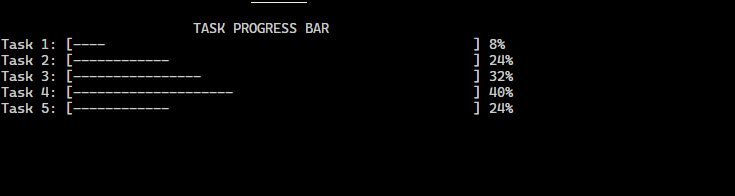
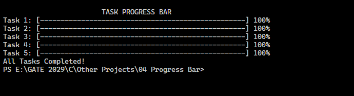

# 04 Progress Bar

A C program that simulates a dynamic command-line progress bar animation in the terminal.

---

## 🚀 Features

* **Real-time Animation:** Displays a updating progress bar using terminal control characters.
* **Percentage Tracker:** Shows completion progress from 0% to 100%.
* **Customizable Speed:** Uses time delays to simulate real task execution.

---

## 📸 Output Preview

### Tasks Incomplete

### Tasks Complete

